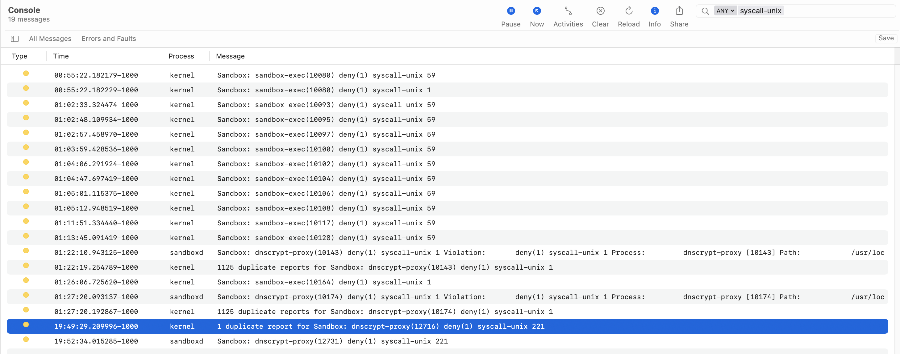

# macos-dnscrypt-proxy-sandbox
[](https://github.com/GoOnNowGit/macos-dnscrypt-proxy-sandbox/actions/workflows/main.yml)

MacOS sandbox for dnscrypt-proxy
## Install
#### Install dnscrypt-proxy (if you haven't already)
```
brew install dnscrypt-proxy
```
#### Clone this repo
```
git clone https://github.com/GoOnNowGit/macos-dnscrypt-proxy-sandbox.git
cd macos-dnscrypt-proxy-sandbox
```
#### Setup Links
```
sudo install -o root -g wheel -m 0644 goonnowgit.dnscrypt-proxy.plist /Library/LaunchDaemons
sudo install -o root -g wheel -m 0644 dnscrypt-proxy.sb /usr/local/sbin
```
#### Start the sandboxed dnscrypt-proxy via launchctl
```
sudo launchctl load -w /Library/LaunchDaemons/goonnowgit.dnscrypt-proxy.plist
sudo launchctl list | grep dnscrypt-proxy
```
#### Or just start it manually
```
sudo sandbox-exec -f "${HOME}"/dnscrypt-proxy.sb /usr/local/opt/dnscrypt-proxy/sbin/dnscrypt-proxy --config /usr/local/etc/dnscrypt-proxy.toml
```

# My goal is to build a minimal syscall profile for dnscrypt-proxy
## How I Started
* I accumulated the *.sb files on the system.  This was done more as a convenience to easily grep across files.
```
mkdir sandbox_files
sudo find /usr/share/sandbox -xdev -name "*.sb" -type f -exec sh -c 'ln -s {} sandbox_files/"$(basename {})"' \;
```

### Get a baseline syscall profile via dtruss
* Begin tracing dnscrypt-proxy and perform some DNS lookups, etc.
```
sudo dtruss /usr/local/sbin/dnscrypt-proxy -config /usr/local/etc/dnscrypt-proxy.toml |& tee dnscrypt.dtruss
```
* (Optional) Set your DNS server to localhost (Specify the correct interface)
```
networksetup -setdnsservers 'Wi-Fi' 127.0.0.1
```
or just
```
dig @127.0.0.1 <some domain>
```

* Ctrl + C the process
* Parse out the syscalls
```
perl -lne 'print "$1" if /syscall::(\w+):return/ || /(^[\w\d_]{4,}?)\(/' dnscrypt.dtruss | sort -u
```
* Add the syscalls to the sandbox profile. I used the syscall block in, **/usr/share/sandbox/cvmsServer.sb** as a reference.

### Start the Console.app
* Press start (play button) at the top of the window
* Set the filter to *syscall-unix*
* Start the sandboxed dnscrypt-proxy
```
sudo sandbox-exec -f "${HOME}"/dnscrypt-proxy.sb /usr/local/opt/dnscrypt-proxy/sbin/dnscrypt-proxy --config /usr/local/etc/dnscrypt-proxy.toml
```
* look in the Console for *deny syscall-unix* log entries...
```
kernel Sandbox: sandbox-exec(<pid>) deny(1) syscall-unix <syscall #>
```


* Look up the syscall name corresponding to the syscall number in the Console output.  I used, https://sigsegv.pl/osx-bsd-syscalls/.
* Add the syscall to the sandbox file

## Rinse and repeat

* **Disclaimer**: This is still a work in progress and is ultimately for fun...

* Also, as Apple states in their sandbox files:
```
WARNING: The sandbox rules in this file currently constitute
Apple System Private Interface and are subject to change at any time and
without notice.
```
